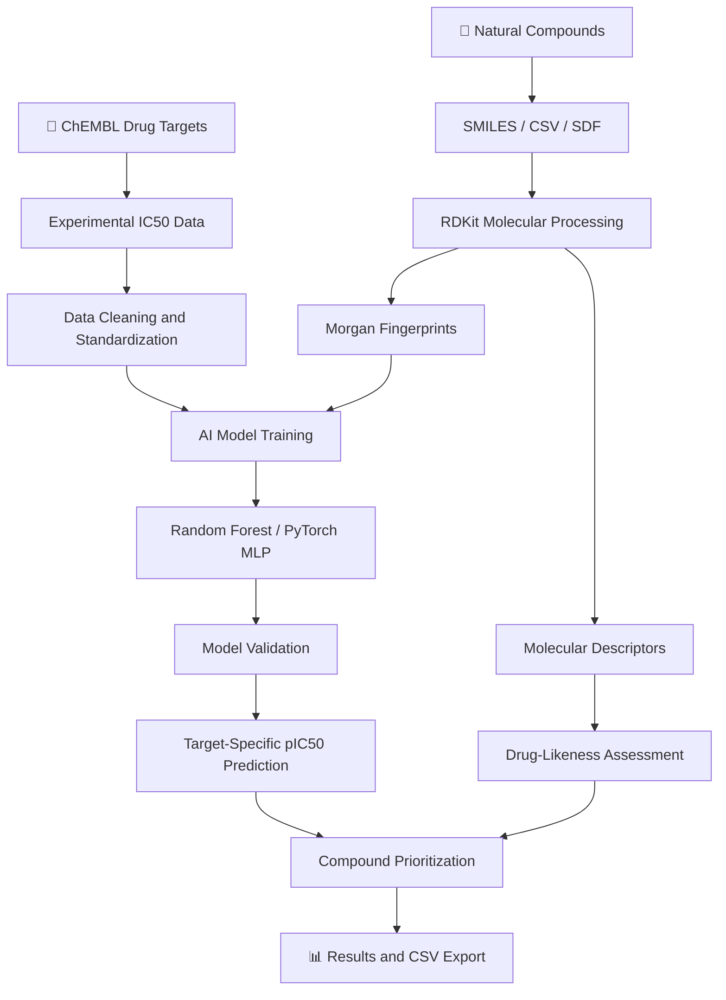
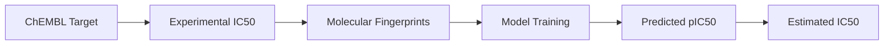
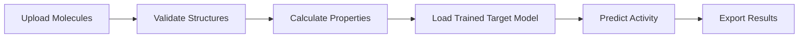

# 🧬 NatDrug-AI
### An AI-Powered Platform for Natural Product Drug Discovery and Target-Specific Bioactivity Prediction

**Molecular Informatics | Artificial Intelligence | Natural Products | Drug Discovery**


---

## 🔬 Overview

**NatDrug-AI** is a computational drug discovery platform designed to accelerate the screening and prioritization of natural compounds.

It integrates molecular descriptors, drug-likeness assessment, experimental bioactivity datasets, machine learning, and deep learning within an interactive Streamlit application.

Researchers can upload their own natural compounds, investigate therapeutically relevant protein targets, train target-specific models, and predict inhibitory activity.

### Key capabilities

- 🧪 Molecular property and drug-likeness analysis
- 🎯 Drug-target discovery using ChEMBL
- 🧠 Random Forest and PyTorch neural-network models
- 🌿 Screening of natural-product libraries
- 📊 Interactive molecular analysis and model visualization
- 📁 CSV/SDF compound uploads and batch predictions
- 📥 Downloadable screening results

---

## 🧭 NatDrug-AI Workflow



---

## 🖥️ Application Dashboard

Add screenshots of the running Streamlit application to a folder named `assets`.


*Figure 1. Main NatDrug-AI interface showing the research dashboard.*


*Figure 2. Therapeutic target discovery using ChEMBL.*


*Figure 3. Machine-learning and deep-learning model training interface.*


*Figure 4. Natural compound screening and prediction results.*

**Note:** These image links will display after you add your own screenshots with the corresponding filenames.

---

## ⚗️ Drug-Likeness Analysis

NatDrug-AI uses RDKit to calculate molecular properties relevant to early-stage compound screening.

| Descriptor | Description |
|---|---|
| Molecular weight | Molecular mass |
| LogP | Estimated lipophilicity |
| TPSA | Topological polar surface area |
| HBD | Hydrogen bond donors |
| HBA | Hydrogen bond acceptors |
| Rotatable bonds | Molecular flexibility |
| QED | Quantitative estimate of drug-likeness |
| Lipinski | Rule-of-five assessment |
| Veber | Rule-based oral bioavailability screening |

These descriptors are screening indicators and do not establish clinical efficacy, safety, or approval probability.

---

## 🎯 Target-Specific Bioactivity Prediction

NatDrug-AI retrieves experimental inhibitory activity data from ChEMBL for selected protein targets.



The pIC50 transformation is:

**pIC50 = 9 − log10(IC50 in nM)**

Higher pIC50 generally indicates stronger measured inhibitory potency within a comparable assay context.

Predictions are computational estimates and require experimental validation.

---

## 🧠 Machine Learning and Deep Learning

| Feature | Random Forest | PyTorch MLP |
|---|---|---|
| Model type | Ensemble regression | Feed-forward neural network |
| Input | Morgan fingerprints | Morgan fingerprints |
| Prediction | pIC50 | pIC50 |
| Training data | Experimental ChEMBL records | Experimental ChEMBL records |
| Evaluation | Cross-validation | Cross-validation |

### Model evaluation

Recommended metrics include:

- Mean Absolute Error (MAE)
- Root Mean Squared Error (RMSE)
- Coefficient of Determination (R²)
- Scaffold-based generalization
- External test-set performance

Model comparisons should use identical curated datasets and data splits.

---

## 🌿 Upload Your Own Natural Compounds

NatDrug-AI supports SMILES-based analysis and CSV/SDF uploads.

Example CSV:

```csv
Name,SMILES
Caffeine,Cn1c(=O)c2c(ncn2C)n(C)c1=O
Resveratrol,Oc1ccc(/C=C/c2cc(O)cc(O)c2)cc1
```

### Screening workflow



The output can include molecular descriptors, QED, rule-based assessments, predicted pIC50, estimated IC50, and similarity to training compounds.

---

## 🚀 Installation

### Requirements

- macOS, Linux, or Windows
- Python 3.12 recommended
- Internet connection for live ChEMBL retrieval

### Clone or download the project

```bash
git clone YOUR_REPOSITORY_URL
cd NatDrug_AI
```

Replace `YOUR_REPOSITORY_URL` with the actual repository URL after publishing the project.

### Create a virtual environment

```bash
python3.12 -m venv .venv
source .venv/bin/activate
```

On Windows:

```powershell
.venv\Scripts\activate
```

### Install dependencies

```bash
python -m pip install --upgrade pip
python -m pip install -r requirements.txt
```

### Launch NatDrug-AI

```bash
python -m streamlit run app.py
```

Open:

**http://localhost:8501**

---

## 📂 Project Structure

```text
NatDrug_AI/
├── app.py
├── requirements.txt
├── README.md
├── example_compounds.csv
├── assets/
│   ├── dashboard.png
│   ├── target_discovery.png
│   ├── model_training.png
│   └── compound_screening.png
├── data/                 # Generated or downloaded data
└── models/               # Saved trained models
```

Some directories are created during application use.

---

## 📚 Data Sources and Technologies

| Resource | Purpose |
|---|---|
| ChEMBL | Experimental bioactivity and target information |
| RDKit | Molecular processing and cheminformatics |
| scikit-learn | Random Forest and model evaluation |
| PyTorch | Neural-network training |
| Streamlit | Interactive web application |
| Pandas and NumPy | Data handling and numerical processing |

Official resources:

- [ChEMBL](https://www.ebi.ac.uk/chembl/)
- [RDKit](https://www.rdkit.org/)
- [PyTorch](https://pytorch.org/)
- [Streamlit](https://streamlit.io/)

---

## 🔍 Research Applications

NatDrug-AI can support:

- Natural-product library prioritization
- Target-specific bioactivity prediction
- Structure–activity relationship exploration
- Comparative molecular property analysis
- Computational hit identification
- Early-stage hypothesis generation for experimental testing

---

## ⚠️ Scientific Limitations

NatDrug-AI is a research prototype.

Predicted inhibitory activity is not experimental evidence of binding, therapeutic efficacy, or clinical safety. Model reliability depends on the quality, quantity, and chemical diversity of the training data.

Clinical target annotations should be checked against authoritative records. External validation and appropriate applicability-domain analysis are necessary before interpreting predictions for structurally novel natural products.

---

## 👨‍🔬 Author

**Dr. Krishna Kant Gupta**

Rajiv Gandhi Institute of Information Technology and Biotechnology  
Bharati Vidyapeeth (Deemed to be University)  
Pune, Maharashtra, India

---

## 📖 Citation

If you use NatDrug-AI in your research, please cite the associated publication when available.

**Manuscript in preparation:**  
*NatDrug-AI: An Integrated Machine Learning and Deep Learning Platform for Natural Product Drug-Likeness Assessment and Target-Specific Bioactivity Prediction.*

A formal citation and DOI will be added following publication.

---

## 📜 License

A software license has not yet been specified. Add a `LICENSE` file before distributing the project under an open-source license.

---

**NatDrug-AI — Integrating Natural Product Chemistry, Cheminformatics, and Artificial Intelligence for Drug Discovery.**
